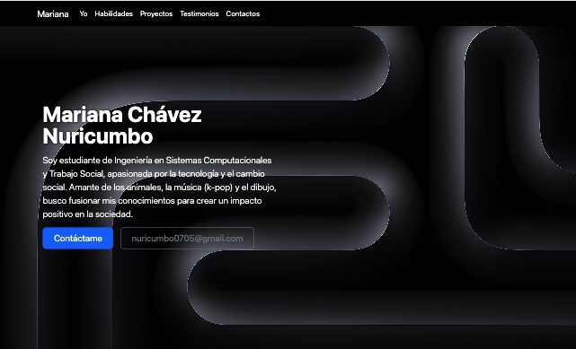
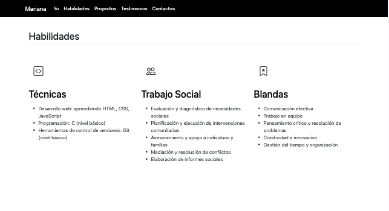
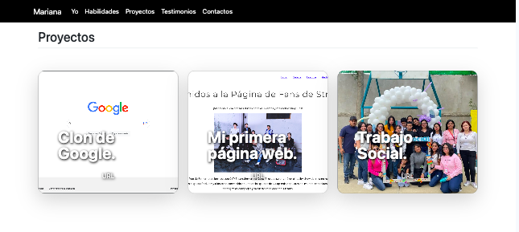
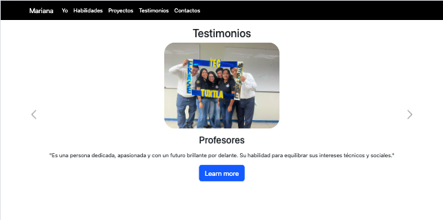
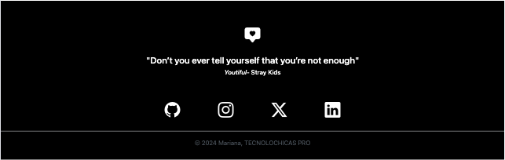

# Mi portafolio de habilidades TECNOLOCHICAS PRO

El presente proyecto es un protafolio desarrollado para poner en práctica las habilidades obtenidas dentro del bootcamp de desarrollo frontend de Tecnolochicas PRO.

Fue dessarrollado con HTML, CSS y JS, con el uso del framework de UI Bootstrap utilizando ,además de bibliotecas externas.

La págian es responsiva (adaptable a diferentes tamaños de pantalla) e incluye la presentación de la autora del proyecto.

Proyecto desplegado https://portafolio-b7-g1-five.vercel.app/

## Secciones de mi sitio
 

## Tecnología
* HTML
* CSS
* Bootstrap
* JavaScript

---

Desarrollado con amor por [Mariana](https://www.instagram.com/mari_.chvz/) en [Tecnolochicas PRO](https://tecnolochicas.mx/)
